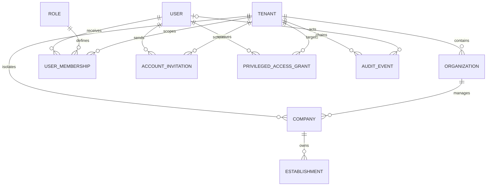

# ERD

```mermaid
erDiagram
    TENANT ||--o{ ORGANIZATION : contains
    TENANT ||--o{ COMPANY : isolates
    ORGANIZATION ||--o{ COMPANY : manages
    COMPANY ||--o{ ESTABLISHMENT : owns
    USER ||--o{ USER_MEMBERSHIP : receives
    ROLE ||--o{ USER_MEMBERSHIP : defines
    TENANT ||--o{ USER_MEMBERSHIP : scopes
    USER ||--o{ ACCOUNT_INVITATION : sends
    TENANT ||--o{ ACCOUNT_INVITATION : scopes
    USER ||--o{ PRIVILEGED_ACCESS_GRANT : receives
    TENANT ||--o{ PRIVILEGED_ACCESS_GRANT : targets
    TENANT ||--o{ AUDIT_EVENT : chains
    USER o|--o{ AUDIT_EVENT : acts
```

O ERD eleitoral será adicionado apenas com modelos reais. A ausência intencional de ligação entre `Ballot` e qualquer identidade é uma invariante arquitetural.
